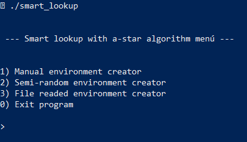

# Informe | estrategias de búsqueda

<br>

Inteligencia Artificial - ESIT (Escuela superior de Ingeniería y Tecnología) ULL
***

<br>
<br>
<br>
<br>
<br>
<br>
<br>


<br>
<br>
<br>
<br>
<br>
<br>
<br>
    
    Informe desarrollado por Éric Dürr Sierra y Elena Rijo García

                            (alu0101027005)      (alu?????????)
<br>
<br>
<br>
<br>

<!-- end of cover page --->
***

<introducción al documento>

<br>
<br>
<br>


## **Índice** &emsp;&emsp;&emsp;&emsp;&emsp;&emsp;&emsp;&emsp;&emsp;&emsp;&emsp;&emsp;&emsp;&emsp;&emsp;&emsp;&emsp;&emsp;&emsp;&emsp;&emsp;&emsp;&emsp;&emsp;&emsp;Página:
 

## 1. [Introducción](#id1) 
## 2. [Entrorno de simulación y programación](#id2) 
## 3. [Metodología de trabajo](#id3)  
## 4. [Algoritmos de búsqueda](#id4) 
## 5. [Evaluación experimental del algoritmo](#id5)  
## 6. [Conclusiones](#id6) 
## 7. [Referencias](#id7) 


<br>
<br>
<br>
<br>
<br>
<br>
<br>
<br>
<br>
<br>
<br>
<br>
<br>
<br>
<br>
<br>
<br>
<br>
<br>
<br>

***

<!-- end of index page --->
<br>
<br>
<br>
<br>
 
<br>
<br>
<div id="id1">
<br>
<br>

## **1. Introducción.**
<br>
<br>

### 1.1. Breve descripción del problema


<br>
<br>

### 1.2. Formulación del problema como espacio estados


<br>
<br>
<div id="id2">
<br>
<br>

## **2. Entrorno de simulación y programación.**
<br>
<br>

### 2.1. Descripción de la interfaz.
<br>
<br>

<br>
<br>

### 2.2. Descripción de la implementación.
<br>
<br>

Para la construcción de los elementos de la implementación se ha optado por 
emplear un paradigma OOP (Object Oriented Programming) de modo que se distingan 
los objetos clave del entorno y que cada uno almacene y contenga la 
funcionalidad que se espera del mismo. 

Los objetos que se emplean se pueden resumir como:
```
  [Búsqueda] -> Sirve para contener el entorno donde se halla el coche autónomo y 
                las estructuras de datos que permiten implementar el algoritmo
  
  [Entorno] -> Construye una matriz de casillas que representan ubicaciones, además
               esta clase aporta datos como el punto de origen, el punto de destino
               y los valores heurísticos que se han obtenido del mismo.
  
  [Casilla] -> Representa el estado, la ubicación y la relación respecto a otros 
               elementos del entorno. Principalmente se emplea para ubicar el coche,
               obstáculos y demás estados.
  
  [Coche]   -> Es un objeto ideado para expresar su propio movimiento el entorno 
               actualizándose simultáneamente a las operaciones que se hacen en 
               el mismo. Además es el contenedor del sensor que detecta que 
               ubicaciones son posibles. 

```

Un entorno se compone por casillas, que a su vez, cualquiera de ellas puede 
contener un objeto coche. Por otro lado el objeto de búsqueda, que es el que 
contiene la implementación del algoritmo, contendra atributos que expresen el 
entorno que manipula, las listas de datos para la implementación del algoritmo 
y casillas destacables como el inicio o el fin de la búsqueda.

<br>
<br>

**Clase coche (SmartCar)**

Su implementación es sencilla se compone por unos atributos que permiten definir su posición en el tablero y un vector de booleanos que representan las lecturas del sensor para los puntos cardinales.

El método más destacable de entre los implementados es "check_environment()" que
permite hacer una lectura del entorno pasado por argumento y actualizar el sensor
en base a la ubicación actual y los elementos encontrados en el entorno.

```cpp
void SmartCar::check_environment(Environment& env) {
  if (env.pos(loc_i_ - 1, loc_j_) == -1) {
    sensor_[N] = true;
  } else {
    sensor_[N] = env.at(loc_i_ - 1, loc_j_).is_obs();
  }
  if (env.pos(loc_i_ + 1, loc_j_) == -1) {
    sensor_[S] = true;
  } else {
    sensor_[S] = env.at(loc_i_ + 1, loc_j_).is_obs();
  }

  if (env.pos(loc_i_, loc_j_ + 1) == -1) {
    sensor_[E] = true;
  } else {
    sensor_[E] = env.at(loc_i_, loc_j_ + 1).is_obs();
  }

  if (env.pos(loc_i_, loc_j_ - 1) == -1) {
    sensor_[W] = true;
  } else {
    sensor_[W] = env.at(loc_i_, loc_j_ - 1).is_obs();
  }
}
```

El resto de métodos sirven para solicitar datos del objeto.

<br>
<br>

**Clase casilla (Slot)**

Se podría comparar su implementación a la de un nodo de cualquier SLL
donde se puede conocer el contenido, la ubicación actual y su nodo predecesor.
Sin embargo esta clase presenta algunas particularidades que personalizan su aplicación para el caso concreto.

En ella se definen algunas constantes que serán útiles para la impresión
de los roles que pueden interpretar estas casillas. También se define un enum
de cara a identificar y transformar estos objetos de una manera más natural y 
semántica que mediante números.

```cpp

#define OBST_CHR " ■ "
#define VOID_CHR " · "
#define CAR__CHR " © "
#define GOAL_CHR " X "

#define U_PATH_CHR " ↑ "
#define R_PATH_CHR " → "
#define D_PATH_CHR " ↓ "
#define L_PATH_CHR " ← "

enum slot_t { V, O, C, G, U, R, D, L };

```
Debido a que se está trabajando con algoritmos de búsqueda esta clase tiene unas 
componentes para facilitar el cálculo durante el algoritmo, cada casilla podrá almacenar y actualizar sus respectivos valores (g) y (f). En este objeto también 
se sobrecarga el operador de igualdad que permitirá comparar nodos durante el
algoritmo.

<br>
<br>

**Clase entorno (Environment)**

Esta implementación simula una matriz en un vector de la STL, este contendrá 
objetos de tipo casilla (Slot). Para simular la matriz se calcula la ubicación
dentro del vector en términos de *i* y *j*, el método "pos(i, j)" permitirá hacer
esta transformación

``` cpp
int Environment::pos(int i, int j) const {
  if (i >= 0 && j >= 0 && i < m_ && j < n_) {
    return (i)*n_ + j;
  } else {
    return -1;
  }
}
```
Nótese que se verifica que una posición corresponda a un rángo adecuado, al 
controlar esto podremos identificar como obstáculos (devolviendo -1) aquellas 
posiciones que pudieran ser paredes.

Esta clase es destacable también por manejar todo lo relativo a las casillas que
contiene, ya sea estableciendo el estado de cada una de ellas o moviendo el coche
en un determinado sentido. 

Es aquí donde se han implementado las funciones heurísticas ya que aportan datos 
relativos al entorno. Las dos funciones heurísticas implementadas son la Manhattan
y la Euclídea. Su explicación y justificación se desarrollará más abajo en el 
apartado [4.3](#id4d3). Se implementan 3 opciones para cada una de ellas donde se 
puede optar por:

- Identificar su valor desde el inicio hasta la meta
```cpp
double Environment::lineal_d() {
  return sqrt(pow(get_goal().pos_j() - get_car().pos()[1], 2) +
              pow(get_goal().pos_i() - get_car().pos()[0], 2));
}

double Environment::manhattan_d() {
  return (abs(get_goal().pos_i() - get_car().pos()[0]) +
          abs(get_goal().pos_j() - get_car().pos()[1]));
}
```
- Calcular desde cualquier nodo al nodo destino
```cpp
double Environment::lineal_d(const Slot& begin) {
  return sqrt(pow(get_goal().pos_j() - begin.pos_j(), 2) +
              pow(get_goal().pos_i() - begin.pos_i(), 2));
}

double Environment::manhattan_d(const Slot& begin) {
  return (abs(get_goal().pos_i() - begin.pos_i()) +
          abs(get_goal().pos_j() - begin.pos_j()));
}
```
- Calcular entre dos ubicaciones cualesquiera
```cpp
double Environment::lineal_d(const Slot& begin, const Slot& end) {
  return sqrt(pow(end.pos_j() - begin.pos_j(), 2) +
              pow(end.pos_i() - begin.pos_i(), 2));
}

double Environment::manhattan_d(const Slot& begin, const Slot& end) {
  return (abs(end.pos_i() - begin.pos_i()) + abs(end.pos_j() - begin.pos_j()));
}
```
<div id="rand">

También se implementa para los objetos de tipo entorno un método que permita la 
generación aleatoria de obstáculos dentro de la misma dado un porcentaje de volumen.


```cpp
void Environment::random_obs(float ratio) {
  srand(time(NULL));
  int r_obs = ratio * n_ * m_;

  for (int i = 0; i < r_obs; i++) {
    int r_m = rand() % m_;
    int r_n = rand() % n_;
    if ((at(r_n, r_m).s_type() != C) && (at(r_n, r_m).s_type() != G)) {
      set_obs(r_n, r_m);
    }
  }
}
```

Tal y como se aprecia lo que hace es, dentro de los límites, establecer tantos 
objetos como el ratio lo permita en posiciones aleatorias  que se computan en base
a los límites del objeto.

La impresión del entorno también se define aquí, en este y en las clases que contiene
se sobrecarga el operador de salida estandar "<<" para que al imprimir el objeto
se visualice por consola o hacia donde sea direccionada la salida todos los 
elementos del entorno.

```cpp
std::ostream& operator<<(std::ostream& os, Environment& obj) {
  os << "┌";
  for (int i = 0; i < obj.n_; i++) os << "───";
  os << "┐\n";

  for (int i = 0; i < obj.m_; i++) {
    os << "│";
    for (int j = 0; j < obj.n_; j++) {
      os << obj.at(i, j);
    }
    os << "│" << i + 1 << "\n";
  }

  os << "└";
  for (int i = 0; i < obj.n_; i++) os << "───";
  os << "┘\n\n";

  return os;
}
```
Los bordes se imprimen usando caracteres especiales en base a los límites del 
propio entorno, luego su contenido dependerá de lo que exprese cada casilla 
individualmente, las casillas son por defecto vacío.

Un ejemplo de la impresión es el siguiente:
```
┌─────────────────────────────────────────────┐
│ ©  ■  ·  ·  ·  ·  ·  ·  ·  ·  ·  ·  ·  ·  · │1
│ ↓  ■  ·  ·  ·  ·  ·  ·  ·  ·  ·  ·  ·  ·  · │2
│ ↓  →  ■  ·  ·  ·  ·  ·  ·  ·  ·  ·  ·  ·  · │3
│ ·  ↓  →  ■  ·  ·  ·  ·  ·  ·  ·  ·  ·  ·  · │4
│ ·  ·  ↓  →  →  →  →  →  →  →  →  →  →  →  → │5
│ ·  ·  ·  ·  ·  ·  ·  ·  ·  ·  ·  ·  ·  ·  ↓ │6
│ ·  ·  ·  ·  ·  ·  ·  ·  ·  ·  ·  ·  ·  ·  ↓ │7
│ ·  ·  ·  ·  ·  ·  ·  ·  ·  ·  ·  ·  ·  ·  ↓ │8
│ ·  ·  ·  ·  ·  ·  ·  ·  ·  ·  ·  ·  ·  ·  ↓ │9
│ ·  ·  ·  ·  ·  ·  ·  ·  ·  ·  ·  ·  ·  ·  ↓ │10
│ ·  ·  ·  ·  ·  ·  ·  ·  ·  ·  ·  ·  ·  ·  ↓ │11
│ ·  ·  ·  ·  ·  ·  ·  ·  ·  ·  ·  ·  ·  ·  ↓ │12
│ ·  ·  ·  ·  ·  ·  ·  ·  ·  ·  ·  ·  ·  ·  ↓ │13
│ ·  ·  ·  ·  ·  ·  ·  ·  ·  ·  ·  ·  ·  ·  ↓ │14
│ ·  ·  ·  ·  ·  ·  ·  ·  ·  ·  ·  ·  ·  ·  X │15
└─────────────────────────────────────────────┘
```
Los números podrán permitir la pronta identificación de cada fila, no se incluyen en
horizontal para controlar el tamaño del propio tablero mejor, igualmente es fácil
identificar cada casilla mediante su punto o su elemento.

El camino se imprime con casillas que representan ese estado con una flecha que
indica el movimiento anteriormente realizado.


<br>
<br>

**Clase de búsqueda (Search)**

Esta clase incorpora el resto de elementos antes mencionados para centralizar la 
operatividad del programa y así simplificar el programa principal.

Esta clase emplea múltiples métodos, los cuales serán explicados con un mayor 
detenimiento ya que es donde se ubica el núcleo de la implementación del 
propósito principal del algoritmo.

Para ser construida se requiere que un entorno ya haya sido definido previamente
incluyendo la ubicación del inicio, el destino y cada uno de los obstáculos que, contiene, en base a esto y a un modo de resolución indicado en el propio constructor
se definirá la implementación del algoritmo con una de las funciones heurísticas.

Esta función heurística será devuelta en base a esa elección por el método 
"heuristic_function(casilla)" que devolverá el valor adecuado respecto a la 
casilla indicada. 

```cpp
double Search::heuristic_function(const Slot& valor) {
  switch (opcion_) {
    case 1:
      return env_.lineal_d(valor);
      break;

    case 2:
      return env_.manhattan_d(valor);
      break;
    default:
      break;
  }
}
```
> NOTA: Se ha usado un switch de cara a que en un futuro se pudieran añadir más 
funciones heurísticas.

<br>

Se implementan múltiples métodos accesores y de obtención de estados de los 
elementos de la clase que serán útiles durante el cálculo del algoritmo:

```cpp
  bool o_list_empty(void); /* comprobar si la lista abierta está vacía */
  bool c_list_empty(void); /* comprobar si la lista cerrada está vacía */

  /* Devuelve las posiciones i y j  de unos Slot específicos */
  std::vector<int> get_start_pos(void); 
  std::vector<int> get_car_pos(void);
  std::vector<int> get_goal_pos(void);


  std::string path_to_string(void); /* Imprime el camino óptimo como una cadena*/
  int path_size(void); /* Devuelve el tamaño del camin óptimo*/

```

Poir último el algoritmo de búsqueda, que es el A-Estrella será explicado en 
mayor detalle en los apartados [4.1](#id4d1) y [4.2](#id4d2). 

El algoritmo se sirve de la funcionalidad de unos cuantos métodos:

- is_in_open(Slot) : Permite saber si una casilla está en la lista abierta

- is_in_close(Slot) : Permite saber si una casilla está en la lista cerrada

- trace_path(Slot) : una vez hallado el final se dibuja el camino de salida

  (de no hallarse se opta por no imprimir nada y se notifica mediante un mensaje el éxito o el fracaso de la búsqueda)


<br>
<br>

**Programa principal "Smart lookup"**

El programa principal tiene dos modos de uso

- Modo mediante linea de comandos**

Para un acceso más rápido se ha hecho una lectura de la línea de comandos de manera que si se quisiera lanzar el programa mediante la lectura de un fichero que describa el entorno o directamente ejecutar una versión aleatoria del programa basta con
ejecutar el programa con las opciones adecuadas
- ```./smart_lookup -f fichero_de_entrada.txt```
- ```./smart_lookup -r```

Esta lectura se ha hecho mediante la función "getopt()" construida en C++.

Sin embargo si se hiciera una ejecución sin argumentos del programa se entraría
en un menú de opciones que irá guiando al usuario, estos aspectos ya han sido 
descritos en el apartado [2.1](#id2d1).

La implementación de este programa principal trata de refactorizar, en la medida
de lo posible, el máximo número de funcionalidades en subrutinas que serán invocadas
durante la ejecución. De esta manera la totalidad de la función principal 
está compuesta por el bucle while del menú (sin contar la lectura de comandos).
Este bucle termina cuando el usuario lo indica y siempre que se lanza una opción
se limpia la terminal.

```cpp
 while (op != 0) {
      std::cout << "\n\n --- Smart lookup with a-star algorithm menú ---\n";
      std::cout << std::endl;
      std::cout << std::endl;
      std::cout << "1) Manual environment creator\n";
      std::cout << "2) Semi-random environment creator\n";
      std::cout << "3) File readed environment creator\n";
      std::cout << "0) Exit program\n\n";
      std::cout << "> ";
      std::cin >> op;
      switch (op) {
        case 1:
          manual_env();
          break;

        case 2:
          random_env();
          break;

        case 3:
          std::cout << "Type a valid filename: ";
          std::cin >> filename;
          file_env(filename);
          break;

        default:
          std::cout << "Option not suported\n";
          break;
      }
      if (op != 0) {
        std::cout << "Press ENTER to continue: \n";
        std::getchar();
        std::getchar();
      }
      system("clear");
    }
  }
```

Tal y como se puede apreciar cada una de las funcionalidades se encapsulan en funciónes que se invocan según lo desea el usuario quedando de esta manera un código 
más sencillo de leer y más sintetizado. Durante la ejecución se ve de la siguiente manera:



Dado que las subrutinas funcionan todas de manera similar analizaremos en detalle
una sola de ellas, en concreto la creación manual del entorno por ser más completa.

En esta subrutina el primer paso consiste en establecer los valores básicos
para constituir el entorno, para ello se le solicita su inserción al usuario por
linea de comandos.

a la hora de solicitar las posiciones de inicio, fin u obstáculos se verifica
que los valores introducidos están dentro del rango esperado, en caso contrario se notifica y se vuelve a solicitar el valor

```cpp
while (inrange == false) {
  std::cout << "Now introduce the start position (Example: 1 1): ";
  std::cin >> st_pos_i >> st_pos_j;
  if (man_env.pos(st_pos_i - 1, st_pos_j - 1) != -1) {
    inrange = true;
  } else {
    std::cout << "\nERROR: Make sure that the numbers are between 1 and the "
                 "limits\n"
              << "try again\n\n";
  }
}
```
Un bucle while controlado por una variable de estado nos permitirá realizar esto de manera cómoda. Se hace uso de la función pos del entorno para comprobar que esté
en el rango, ya que esta devolverá -1 en caso de errar, haciendo más simple el condicional.

Una vez superado el bucle se reestablece el valor de inrange a falso para su posterior uso.

> Nótese que se espera que los números a introducir se expresen en términos de [1 - N] ya que este tipo de rangos suele ser más intuitivo para todo el mundo.

La creación de obstáculos en este modo es opcional, por ello se pregunta primero al usuario y , en caso afirmativo, se lanza el método para la introducción uno a uno 
de los obstáculos.

```cpp
std::cout << "Do you want to introduce some obstacles? (yes/no): ";
std::cin >> obs_bool;
if (obs_bool[0] == 'Y' || obs_bool[0] == 'y') {
    introduce_obstacles(man_env);
}
```
 
Sigue la misma metodología para detectar posiciones correctas y cada obstáculo
es solicitado e introducido hasta que se decide parar de introducir.

```cpp
while (1) {
  std::cout << std::endl;
  std::cout << std::endl;
  std::cout << "Set an obstacle as done with the start or goal point "
               "(Example: 2 2): ";
  std::cin >> obs_i_pos >> obs_j_pos;

  if (man_env.pos(obs_i_pos - 1, obs_j_pos - 1) == -1) {
    std::cout << "\nERROR: Make sure that the numbers are between 1 and "
                 "the limits\n"
              << "try again\n\n";
  } else {
    man_env.set_obs(obs_i_pos - 1, obs_j_pos - 1);
  }
  std::cout << "Do you want to stop adding obstacles? (yes/no): ";
  std::cin >> continuer;
  if (continuer[0] == 'Y' || continuer[0] == 'y') {
    return;
  }
}
```

El paso siguiente a la consitución de obstáculos es la selección del valor heurístico
donde se da a elegir entre las opciones disponibles, el usuario debe elegir 
introduciendo por teclado, la opción que desea.

Una vez elegida se crea el objeto de búsqueda pasándole el entorno y la opción 
heurística como argumentos. A continuación de esto se lanza el algoritmo de búsqueda.
```cpp
Search man_env_search(man_env, h_op);
man_env_search.a_star_algorithm();
```

Para finalizar se imprime el camino de resultado por salida estandar y en caso
de que las dimensiones sean mayor de 100x100 esta salida se redirige a un fichero
de texto.

```cpp
if (row_sz >= 100 || col_sz >= 100) {
  std::cout << "Output file generated because of the size\n";
  std::ofstream output("man_result.txt");
  output << man_env_search << std::endl;
  output.close();
} else {
  std::cout << man_env_search << std::endl;
}
```

Tal y como se ha mencionado las otras subrutinas son similares pero con algunos aspectos particulares.

Para la creación aleatoria del entorno los obstáculos son generados introduciendo 
una opción de ratio de obstáculos y llamando al método ya descrito [random_obs()](#rand). El resto de la implementación es similar a la opción manual.


<br>
<br>

### 2.3. Argumentación sobre el entorno de programación escogido.


<br>
<br>
<div id="id3">
<br>
<br>

## **3. Metodología de trabajo.**
<br>
<br>

### 3.1. Metodología de desarrollo.

<!-- TDD -->
<br>
<br>

### 3.2. Paradigma de programación.

<!-- OOP y como -->
<br>
<br>

### 3.2. Metodología de colaboración  y distribución de carga.
<!-- Git, GitHub, GitHub projects, ... -->

<br>
<br>
<div id="id4">
<br>
<br>

## **4. Algoritmo de búsqueda.**
<br>
<br>


<div id="id4d1">

### 4.1. Pseudo-código.


<br>
<br>

<div id="id4d2">

### 4.2. Estructura de datos empleada.

<br>
<br>

<div id="id4d3">

### 4.3. Funciones heurísticas y justificación.


<br>
<br>
<div id="id5">
<br>
<br>

## **5. Evaluación experimental del algoritmo.**
<br>
<br>

<br>
<br>

### Evaluación de las tablas sin obstáculos 
<br>

| Funciones H | Número de nodos expandidos | Longitud del camino (pasos) | tiempo (s) |
| :------------- | :----------: | :-----------: | -----------: | 
|  Euclidea | xxxxxxxxx | xxxxxxxx    | xxxx |
| Manhattan   | xxxxxxxxx | xxxxxxxx  | xxxx |

<br>
<br>

| Funciones H | Número de nodos expandidos | Longitud del camino (pasos) | tiempo (s) |
| :------------- | :----------: | :-----------: | -----------: | 
|  Euclidea | xxxxxxxxx | xxxxxxxx    | xxxx |
| Manhattan   | xxxxxxxxx | xxxxxxxx  | xxxx |

<br>
<br>

| Funciones H | Número de nodos expandidos | Longitud del camino (pasos) | tiempo (s) |
| :------------- | :----------: | :-----------: | -----------: | 
|  Euclidea | xxxxxxxxx | xxxxxxxx    | xxxx |
| Manhattan   | xxxxxxxxx | xxxxxxxx  | xxxx |


<br>
<br>
<br><br>

### Evaluación de las tablas  25% obstáculos 

<br>

| Funciones H | Número de nodos expandidos | Longitud del camino (pasos) | tiempo (s) |
| :------------- | :----------: | :-----------: | -----------: | 
|  Euclidea | xxxxxxxxx | xxxxxxxx    | xxxx |
| Manhattan   | xxxxxxxxx | xxxxxxxx  | xxxx |

<br>
<br>

| Funciones H | Número de nodos expandidos | Longitud del camino (pasos) | tiempo (s) |
| :------------- | :----------: | :-----------: | -----------: | 
|  Euclidea | xxxxxxxxx | xxxxxxxx    | xxxx |
| Manhattan   | xxxxxxxxx | xxxxxxxx  | xxxx |

<br>
<br>

| Funciones H | Número de nodos expandidos | Longitud del camino (pasos) | tiempo (s) |
| :------------- | :----------: | :-----------: | -----------: | 
|  Euclidea | xxxxxxxxx | xxxxxxxx    | xxxx |
| Manhattan   | xxxxxxxxx | xxxxxxxx  | xxxx |


<br>
<br>
<br><br>

### Evaluación de las tablas 50% obstáculos 

<br>

| Funciones H | Número de nodos expandidos | Longitud del camino (pasos) | tiempo (s) |
| :------------- | :----------: | :-----------: | -----------: | 
|  Euclidea | xxxxxxxxx | xxxxxxxx    | xxxx |
| Manhattan   | xxxxxxxxx | xxxxxxxx  | xxxx |

<br>
<br>

| Funciones H | Número de nodos expandidos | Longitud del camino (pasos) | tiempo (s) |
| :------------- | :----------: | :-----------: | -----------: | 
|  Euclidea | xxxxxxxxx | xxxxxxxx    | xxxx |
| Manhattan   | xxxxxxxxx | xxxxxxxx  | xxxx |

<br>
<br>

| Funciones H | Número de nodos expandidos | Longitud del camino (pasos) | tiempo (s) |
| :------------- | :----------: | :-----------: | -----------: | 
|  Euclidea | xxxxxxxxx | xxxxxxxx    | xxxx |
| Manhattan   | xxxxxxxxx | xxxxxxxx  | xxxx |


<br>
<br>
<br><br>

### Evaluación de las tablas 80% obstáculos 

<br>

| Funciones H | Número de nodos expandidos | Longitud del camino (pasos) | tiempo (s) |
| :------------- | :----------: | :-----------: | -----------: | 
|  Euclidea | xxxxxxxxx | xxxxxxxx    | xxxx |
| Manhattan   | xxxxxxxxx | xxxxxxxx  | xxxx |

<br>
<br>

| Funciones H | Número de nodos expandidos | Longitud del camino (pasos) | tiempo (s) |
| :------------- | :----------: | :-----------: | -----------: | 
|  Euclidea | xxxxxxxxx | xxxxxxxx    | xxxx |
| Manhattan   | xxxxxxxxx | xxxxxxxx  | xxxx |

<br>
<br>

| Funciones H | Número de nodos expandidos | Longitud del camino (pasos) | tiempo (s) |
| :------------- | :----------: | :-----------: | -----------: | 
|  Euclidea | xxxxxxxxx | xxxxxxxx    | xxxx |
| Manhattan   | xxxxxxxxx | xxxxxxxx  | xxxx |


<br>
<br>
<br><br>


<br>
<br>
<div id="id6">
<br>
<br>

## **6. Conclusiones.**
<br>
<br>


<br>
<br>
<div id="id7">
<br>
<br>

## **7. Referencias.**

<!-- aportadas por eric -->
- [Implementación de algoritmo a-estrella | GeeksForGeeks](https://www.geeksforgeeks.org/a-search-algorithm/)
  > Implementación en un solo fichero del algoritmo a-estrella en lenguaje c++.

- [Cálculo del tiempo de ejecución | GeeksForGeeks](https://www.geeksforgeeks.org/measure-execution-time-function-cpp/)
  >

<!-- Aportadas por Elena -->


<br>
<br>