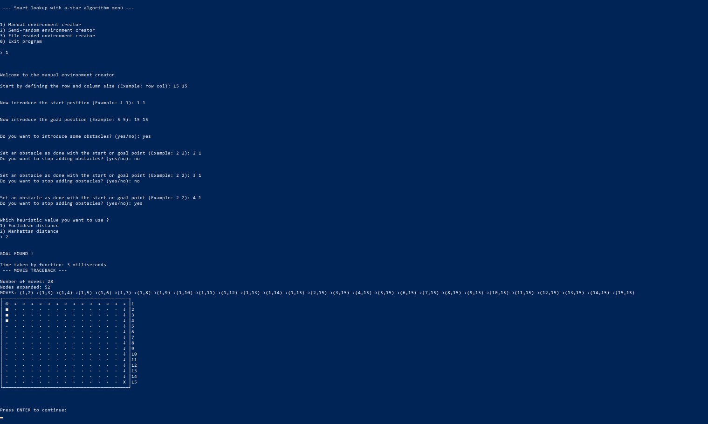
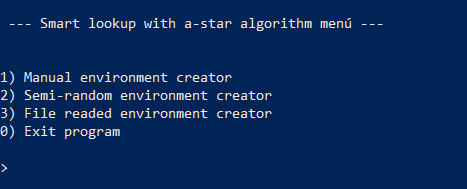
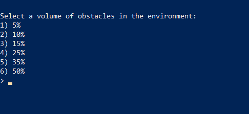

<div style="text-align: justify">
<br>

<span>


<span>


<br>
<br>

<div style="text-align: center">

# Estrategias de búsqueda | Informe  


<br>

Inteligencia Artificial - ESIT (Escuela superior de Ingeniería y Tecnología) ULL
</div>

***

<br>
<br>
<br>
<br>


<br>
<br>
<br>
<br>
    
    Informe desarrollado por Éric Dürr Sierra y Elena Rijo García

                            (alu0101027005)      (alu0101265421)
<br>
<br>
<br>
<br>

<!-- end of cover page --->

En este documento se van a exponer los aspectos relacionados a la práctica de estrategias de búsqueda. El contenido consta de una exposición de la 
implementación, las pruebas y conclusiones para el algoritmo implementado y
una breve explicación sobre las metodologías empleadas.

<br>

***


<br>
<br>
<br>


## **Índice** &emsp;&emsp;&emsp;&emsp;&emsp;&emsp;&emsp;&emsp;&emsp;&emsp;&emsp;&emsp;&emsp;&emsp;&emsp;&emsp;&emsp;&emsp;&emsp;&emsp;&emsp;&emsp;&emsp;&emsp;&emsp;Página:
 

## 1. [Introducción](#id1) 
## 2. [Entrorno de simulación y programación](#id2) 
## 3. [Metodología de trabajo](#id3)  
## 4. [Algoritmos de búsqueda](#id4) 
## 5. [Evaluación experimental del algoritmo](#id5)  
## 6. [Conclusiones](#id6) 
## 7. [Referencias](#id7) 


<br>
<br>
<br>
<br>
<br>
<br>
<br>
<br>
<br>
<br>
<br>
<br>
<br>
<br>
<br>
<br>
<br>
<br>
<br>
<br>

***

<!-- end of index page --->
<br>
<br>
<br>
<br>
 
<br>
<br>
<div id="id1">
<br>
<br>

## **1. Introducción.**
<br>
<br>

### 1.1. Breve descripción del problema

Se plantea un problema de estrategias de búsqueda para la resolución de la trayectoria mas óptima para un coche autónomo.

El entorno está dimensionado en MxN, en el cual nuestro coche va a efectuar sus movimientos, hacia sus casillas vecinas(Norte, Sur, Este y Oeste). Este entorno esta compuesto por celdas libres y celdas ocupadas, donde las celdas ocupadas podrán estar constituidas por un coche, una meta o varios obstáculos.

Nuestro coche, desde un punto inicial, deberá encontrar el camino mas óptimo teniendo en cuentas los diferentes entornos y obstáculos que se le pueden presentar para llegar hasta el punto de finalización (meta).

<br>
<br>

### 1.2. Formulación del problema como espacio estados

El espacio de estados se compondrá por un estado inicial, en el cual en su entorno tendrá el coche y la meta en la posición indicada por el usuario, además de definir dónde y cuántos obstáculos habría. También un estado final, en donde el coche llegaría a la posición de la meta.

Los estados y sus operadores, dependerán tanto del número y de dónde se encuentren los obstáculos como de la posición de la meta y del coche. Además, tenemos que tener en cuenta que cada movimiento del coche se va a ver influido por el estado de la casilla, ya que si hay casillas ocupadas, este no se podría mover hacia ella, reduciendo así el número posible de pasos.
 
<br>
<br>
<div id="id2">
<br>
<br>

## **2. Entorno de simulación y programación.**
<br>
<br>


<div id="id2d1">

### 2.1. Descripción de la interfaz.
<br>
<br>

C++ será el lenguaje de desarrollo de simulación escogido para esta práctica, ya que es un lenguaje que dominamos y hemos ido aprendiendo a lo largo de los cursos académicos. Nos beneficiamos de las ventajas que nos brinda la programación orientada a objetos, así como su modularidad. 

La visualización y simulación del entorno y sus elementos se ha realizado a través de terminal, gracias a un menú con diversas opciones para un fácil manejo para el usuario. Este menú da las opciones de introducir manualmente los datos, teniendo en cuenta la inserción de los obstáculos de manera manual o aleatoria, y la posibilidad de cargar un fichero con los datos introducidos en este. Los datos pedidos al usuarios serán el tamaño MxN del entorno, la posición (i,j) del coche, de la meta, y de los obstáculos, poniendo especial atención en que si se elige la opción aleatoria los obstáculos se generaran en posiciones arbitrarias, excluyendo la posición del coche y de la meta.

También, en terminal, se visualiza la elección de la función heurística deseada, ya sea la función heurística Euclidea o la Manhattan. 

Una vez se haya finalizado la inserción de todos los datos esperados, se generará visualmente nuestro entorno. De primera mano, se visualiza la posición del coche, la meta y los obstáculos, en las posiciones deseadas. Seguidamente, se vuelve a reflejar dicho entorno, pero esta vez mostrando mediante flechas el camino óptimo elegido para llegar al estado final. 

Por último, podemos destacar que cada vez que termine la ejecución del programa, se limpiará la terminal y se lanzará de nuevo el menú por si el usuario desea volver a realizar el programa desde el principio, teniendo también la opción de salir de este.



<br>
<br>

### 2.2. Descripción de la implementación.
<br>
<br>

Para la construcción de los elementos de la implementación se ha optado por 
emplear un paradigma OOP (Object Oriented Programming) de modo que se distingan 
los objetos clave del entorno y que cada uno almacene y contenga la 
funcionalidad que se espera del mismo. 

Los objetos que se emplean se pueden resumir como:
```
  [Búsqueda] -> Sirve para contener el entorno donde se halla el coche autónomo y 
                las estructuras de datos que permiten implementar el algoritmo
  
  [Entorno] -> Construye una matriz de casillas que representan ubicaciones, además
               esta clase aporta datos como el punto de origen, el punto de destino
               y los valores heurísticos que se han obtenido del mismo.
  
  [Casilla] -> Representa el estado, la ubicación y la relación respecto a otros 
               elementos del entorno. Principalmente se emplea para ubicar el coche,
               obstáculos y demás estados.
  
  [Coche]   -> Es un objeto ideado para expresar su propio movimiento el entorno 
               actualizándose simultáneamente a las operaciones que se hacen en 
               el mismo. Además es el contenedor del sensor que detecta que 
               ubicaciones son posibles. 

```

Un entorno se compone por casillas, que a su vez, cualquiera de ellas puede 
contener un objeto coche. Por otro lado el objeto de búsqueda, que es el que 
contiene la implementación del algoritmo, contendra atributos que expresen el 
entorno que manipula, las listas de datos para la implementación del algoritmo 
y casillas destacables como el inicio o el fin de la búsqueda.

<br>
<br>

**Clase coche (SmartCar)**

Su implementación es sencilla se compone por unos atributos que permiten definir su posición en el tablero y un vector de booleanos que representan las lecturas del sensor para los puntos cardinales.

El método más destacable de entre los implementados es "check_environment()" que
permite hacer una lectura del entorno pasado por argumento y actualizar el sensor
en base a la ubicación actual y los elementos encontrados en el entorno.

```cpp
void SmartCar::check_environment(Environment& env) {
  if (env.pos(loc_i_ - 1, loc_j_) == -1) {
    sensor_[N] = true;
  } else {
    sensor_[N] = env.at(loc_i_ - 1, loc_j_).is_obs();
  }
  if (env.pos(loc_i_ + 1, loc_j_) == -1) {
    sensor_[S] = true;
  } else {
    sensor_[S] = env.at(loc_i_ + 1, loc_j_).is_obs();
  }

  if (env.pos(loc_i_, loc_j_ + 1) == -1) {
    sensor_[E] = true;
  } else {
    sensor_[E] = env.at(loc_i_, loc_j_ + 1).is_obs();
  }

  if (env.pos(loc_i_, loc_j_ - 1) == -1) {
    sensor_[W] = true;
  } else {
    sensor_[W] = env.at(loc_i_, loc_j_ - 1).is_obs();
  }
}
```

El resto de métodos sirven para solicitar datos del objeto.

<br>
<br>

**Clase casilla (Slot)**

Se podría comparar su implementación a la de un nodo de cualquier SLL
donde se puede conocer el contenido, la ubicación actual y su nodo predecesor.
Sin embargo esta clase presenta algunas particularidades que personalizan su aplicación para el caso concreto.

En ella se definen algunas constantes que serán útiles para la impresión
de los roles que pueden interpretar estas casillas. También se define un enum
de cara a identificar y transformar estos objetos de una manera más natural y 
semántica que mediante números.

```cpp

#define OBST_CHR " ■ "
#define VOID_CHR " · "
#define CAR__CHR " © "
#define GOAL_CHR " X "

#define U_PATH_CHR " ↑ "
#define R_PATH_CHR " → "
#define D_PATH_CHR " ↓ "
#define L_PATH_CHR " ← "

enum slot_t { V, O, C, G, U, R, D, L };

```
Debido a que se está trabajando con algoritmos de búsqueda esta clase tiene unas 
componentes para facilitar el cálculo durante el algoritmo, cada casilla podrá almacenar y actualizar sus respectivos valores (g) y (f). En este objeto también 
se sobrecarga el operador de igualdad que permitirá comparar nodos durante el
algoritmo.

<br>
<br>

**Clase entorno (Environment)**

Esta implementación simula una matriz en un vector de la STL, este contendrá 
objetos de tipo casilla (Slot). Para simular la matriz se calcula la ubicación
dentro del vector en términos de *i* y *j*, el método "pos(i, j)" permitirá hacer
esta transformación

``` cpp
int Environment::pos(int i, int j) const {
  if (i >= 0 && j >= 0 && i < m_ && j < n_) {
    return (i)*n_ + j;
  } else {
    return -1;
  }
}
```
Nótese que se verifica que una posición corresponda a un rángo adecuado, al 
controlar esto podremos identificar como obstáculos (devolviendo -1) aquellas 
posiciones que pudieran ser paredes.

Esta clase es destacable también por manejar todo lo relativo a las casillas que
contiene, ya sea estableciendo el estado de cada una de ellas o moviendo el coche
en un determinado sentido. 

Es aquí donde se han implementado las funciones heurísticas ya que aportan datos 
relativos al entorno. Las dos funciones heurísticas implementadas son la Manhattan
y la Euclídea. Su explicación y justificación se desarrollará más abajo en el 
apartado [4.3](#id4d3). Se implementan 3 opciones para cada una de ellas donde se 
puede optar por:

- Identificar su valor desde el inicio hasta la meta
```cpp
double Environment::lineal_d() {
  return sqrt(pow(get_goal().pos_j() - get_car().pos()[1], 2) +
              pow(get_goal().pos_i() - get_car().pos()[0], 2));
}

double Environment::manhattan_d() {
  return (abs(get_goal().pos_i() - get_car().pos()[0]) +
          abs(get_goal().pos_j() - get_car().pos()[1]));
}
```
- Calcular desde cualquier nodo al nodo destino
```cpp
double Environment::lineal_d(const Slot& begin) {
  return sqrt(pow(get_goal().pos_j() - begin.pos_j(), 2) +
              pow(get_goal().pos_i() - begin.pos_i(), 2));
}

double Environment::manhattan_d(const Slot& begin) {
  return (abs(get_goal().pos_i() - begin.pos_i()) +
          abs(get_goal().pos_j() - begin.pos_j()));
}
```
- Calcular entre dos ubicaciones cualesquiera
```cpp
double Environment::lineal_d(const Slot& begin, const Slot& end) {
  return sqrt(pow(end.pos_j() - begin.pos_j(), 2) +
              pow(end.pos_i() - begin.pos_i(), 2));
}

double Environment::manhattan_d(const Slot& begin, const Slot& end) {
  return (abs(end.pos_i() - begin.pos_i()) + abs(end.pos_j() - begin.pos_j()));
}
```
<div id="rand">

También se implementa para los objetos de tipo entorno un método que permita la 
generación aleatoria de obstáculos dentro de la misma dado un porcentaje de volumen.


```cpp
void Environment::random_obs(float ratio) {
  srand(time(NULL));
  int r_obs = ratio * n_ * m_;

  for (int i = 0; i < r_obs; i++) {
    int r_m = rand() % m_;
    int r_n = rand() % n_;
    if ((at(r_n, r_m).s_type() != C) && (at(r_n, r_m).s_type() != G)) {
      set_obs(r_n, r_m);
    }
  }
}
```

Tal y como se aprecia lo que hace es, dentro de los límites, establecer tantos 
objetos como el ratio lo permita en posiciones aleatorias  que se computan en base
a los límites del objeto.

La impresión del entorno también se define aquí, en este y en las clases que contiene
se sobrecarga el operador de salida estandar "<<" para que al imprimir el objeto
se visualice por consola o hacia donde sea direccionada la salida todos los 
elementos del entorno.

```cpp
std::ostream& operator<<(std::ostream& os, Environment& obj) {
  os << "┌";
  for (int i = 0; i < obj.n_; i++) os << "───";
  os << "┐\n";

  for (int i = 0; i < obj.m_; i++) {
    os << "│";
    for (int j = 0; j < obj.n_; j++) {
      os << obj.at(i, j);
    }
    os << "│" << i + 1 << "\n";
  }

  os << "└";
  for (int i = 0; i < obj.n_; i++) os << "───";
  os << "┘\n\n";

  return os;
}
```
Los bordes se imprimen usando caracteres especiales en base a los límites del 
propio entorno, luego su contenido dependerá de lo que exprese cada casilla 
individualmente, las casillas son por defecto vacío.

Un ejemplo de la impresión es el siguiente:
```
┌─────────────────────────────────────────────┐
│ ©  ■  ·  ·  ·  ·  ·  ·  ·  ·  ·  ·  ·  ·  · │1
│ ↓  ■  ·  ·  ·  ·  ·  ·  ·  ·  ·  ·  ·  ·  · │2
│ ↓  →  ■  ·  ·  ·  ·  ·  ·  ·  ·  ·  ·  ·  · │3
│ ·  ↓  →  ■  ·  ·  ·  ·  ·  ·  ·  ·  ·  ·  · │4
│ ·  ·  ↓  →  →  →  →  →  →  →  →  →  →  →  → │5
│ ·  ·  ·  ·  ·  ·  ·  ·  ·  ·  ·  ·  ·  ·  ↓ │6
│ ·  ·  ·  ·  ·  ·  ·  ·  ·  ·  ·  ·  ·  ·  ↓ │7
│ ·  ·  ·  ·  ·  ·  ·  ·  ·  ·  ·  ·  ·  ·  ↓ │8
│ ·  ·  ·  ·  ·  ·  ·  ·  ·  ·  ·  ·  ·  ·  ↓ │9
│ ·  ·  ·  ·  ·  ·  ·  ·  ·  ·  ·  ·  ·  ·  ↓ │10
│ ·  ·  ·  ·  ·  ·  ·  ·  ·  ·  ·  ·  ·  ·  ↓ │11
│ ·  ·  ·  ·  ·  ·  ·  ·  ·  ·  ·  ·  ·  ·  ↓ │12
│ ·  ·  ·  ·  ·  ·  ·  ·  ·  ·  ·  ·  ·  ·  ↓ │13
│ ·  ·  ·  ·  ·  ·  ·  ·  ·  ·  ·  ·  ·  ·  ↓ │14
│ ·  ·  ·  ·  ·  ·  ·  ·  ·  ·  ·  ·  ·  ·  X │15
└─────────────────────────────────────────────┘
```
Los números podrán permitir la pronta identificación de cada fila, no se incluyen en
horizontal para controlar el tamaño del propio tablero mejor, igualmente es fácil
identificar cada casilla mediante su punto o su elemento.

El camino se imprime con casillas que representan ese estado con una flecha que
indica el movimiento anteriormente realizado.


<br>
<br>

**Clase de búsqueda (Search)**

Esta clase incorpora el resto de elementos antes mencionados para centralizar la 
operatividad del programa y así simplificar el programa principal.

Esta clase emplea múltiples métodos, los cuales serán explicados con un mayor 
detenimiento ya que es donde se ubica el núcleo de la implementación del 
propósito principal del algoritmo.

Para ser construida se requiere que un entorno ya haya sido definido previamente
incluyendo la ubicación del inicio, el destino y cada uno de los obstáculos que, contiene, en base a esto y a un modo de resolución indicado en el propio constructor
se definirá la implementación del algoritmo con una de las funciones heurísticas.

Esta función heurística será devuelta en base a esa elección por el método 
"heuristic_function(casilla)" que devolverá el valor adecuado respecto a la 
casilla indicada. 

```cpp
double Search::heuristic_function(const Slot& valor) {
  switch (opcion_) {
    case 1:
      return env_.lineal_d(valor);
      break;

    case 2:
      return env_.manhattan_d(valor);
      break;
    default:
      break;
  }
}
```
> NOTA: Se ha usado un switch de cara a que en un futuro se pudieran añadir más 
funciones heurísticas.

<br>

Se implementan múltiples métodos accesores y de obtención de estados de los 
elementos de la clase que serán útiles durante el cálculo del algoritmo:

```cpp
  bool o_list_empty(void); /* comprobar si la lista abierta está vacía */
  bool c_list_empty(void); /* comprobar si la lista cerrada está vacía */

  /* Devuelve las posiciones i y j  de unos Slot específicos */
  std::vector<int> get_start_pos(void); 
  std::vector<int> get_car_pos(void);
  std::vector<int> get_goal_pos(void);


  std::string path_to_string(void); /* Imprime el camino óptimo como una cadena*/
  int path_size(void); /* Devuelve el tamaño del camin óptimo*/

```

Poir último el algoritmo de búsqueda, que es el A-Estrella será explicado en 
mayor detalle en los apartados [4.1](#id4d1) y [4.2](#id4d2). 

El algoritmo se sirve de la funcionalidad de unos cuantos métodos:

- is_in_open(Slot) : Permite saber si una casilla está en la lista abierta

- is_in_close(Slot) : Permite saber si una casilla está en la lista cerrada

- trace_path(Slot) : una vez hallado el final se dibuja el camino de salida

  (de no hallarse se opta por no imprimir nada y se notifica mediante un mensaje el éxito o el fracaso de la búsqueda)


<br>
<br>

**Programa principal "Smart lookup"**


El programa principal tiene dos modos de uso


<br>

**Modo mediante linea de comandos**

Para un acceso más rápido se ha hecho una lectura de la línea de comandos de manera que si se quisiera lanzar el programa mediante la lectura de un fichero que describa el entorno o directamente ejecutar una versión aleatoria del programa basta con
ejecutar el programa con las opciones adecuadas
- ```./smart_lookup -f fichero_de_entrada.txt```
- ```./smart_lookup -r```

Esta lectura se ha hecho mediante la función "getopt()" construida en C++.

<br>

**Modo por defecto (menú)**

Sin embargo si se hiciera una ejecución sin argumentos del programa se entraría
en un menú de opciones que irá guiando al usuario, estos aspectos ya han sido 
descritos en el apartado [2.1](#id2d1).

La implementación de este programa principal trata de refactorizar, en la medida
de lo posible, el máximo número de funcionalidades en subrutinas que serán invocadas
durante la ejecución. De esta manera la totalidad de la función principal 
está compuesta por el bucle while del menú (sin contar la lectura de comandos).
Este bucle termina cuando el usuario lo indica y siempre que se lanza una opción
se limpia la terminal.

```cpp
 while (op != 0) {
      std::cout << "\n\n --- Smart lookup with a-star algorithm menú ---\n";
      std::cout << std::endl;
      std::cout << std::endl;
      std::cout << "1) Manual environment creator\n";
      std::cout << "2) Semi-random environment creator\n";
      std::cout << "3) File readed environment creator\n";
      std::cout << "0) Exit program\n\n";
      std::cout << "> ";
      std::cin >> op;
      switch (op) {
        case 1:
          manual_env();
          break;

        case 2:
          random_env();
          break;

        case 3:
          std::cout << "Type a valid filename: ";
          std::cin >> filename;
          file_env(filename);
          break;

        default:
          std::cout << "Option not suported\n";
          break;
      }
      if (op != 0) {
        std::cout << "Press ENTER to continue: \n";
        std::getchar();
        std::getchar();
      }
      system("clear");
    }
  }
```

Tal y como se puede apreciar cada una de las funcionalidades se encapsulan en funciónes que se invocan según lo desea el usuario quedando de esta manera un código 
más sencillo de leer y más sintetizado. Durante la ejecución se ve de la siguiente manera:



Dado que las subrutinas funcionan todas de manera similar analizaremos en detalle
una sola de ellas, en concreto la creación manual del entorno por ser más completa.

En esta subrutina el primer paso consiste en establecer los valores básicos
para constituir el entorno, para ello se le solicita su inserción al usuario por
linea de comandos.

a la hora de solicitar las posiciones de inicio, fin u obstáculos se verifica
que los valores introducidos están dentro del rango esperado, en caso contrario se notifica y se vuelve a solicitar el valor

```cpp
while (inrange == false) {
  std::cout << "Now introduce the start position (Example: 1 1): ";
  std::cin >> st_pos_i >> st_pos_j;
  if (man_env.pos(st_pos_i - 1, st_pos_j - 1) != -1) {
    inrange = true;
  } else {
    std::cout << "\nERROR: Make sure that the numbers are between 1 and the "
                 "limits\n"
              << "try again\n\n";
  }
}
```
Un bucle while controlado por una variable de estado nos permitirá realizar esto de manera cómoda. Se hace uso de la función pos del entorno para comprobar que esté
en el rango, ya que esta devolverá -1 en caso de errar, haciendo más simple el condicional.

Una vez superado el bucle se reestablece el valor de inrange a falso para su posterior uso.

> Nótese que se espera que los números a introducir se expresen en términos de [1 - N] ya que este tipo de rangos suele ser más intuitivo para todo el mundo.

La creación de obstáculos en este modo es opcional, por ello se pregunta primero al usuario y , en caso afirmativo, se lanza el método para la introducción uno a uno 
de los obstáculos.

```cpp
std::cout << "Do you want to introduce some obstacles? (yes/no): ";
std::cin >> obs_bool;
if (obs_bool[0] == 'Y' || obs_bool[0] == 'y') {
    introduce_obstacles(man_env);
}
```
 
Sigue la misma metodología para detectar posiciones correctas y cada obstáculo
es solicitado e introducido hasta que se decide parar de introducir.

```cpp
while (1) {
  std::cout << std::endl;
  std::cout << std::endl;
  std::cout << "Set an obstacle as done with the start or goal point "
               "(Example: 2 2): ";
  std::cin >> obs_i_pos >> obs_j_pos;

  if (man_env.pos(obs_i_pos - 1, obs_j_pos - 1) == -1) {
    std::cout << "\nERROR: Make sure that the numbers are between 1 and "
                 "the limits\n"
              << "try again\n\n";
  } else {
    man_env.set_obs(obs_i_pos - 1, obs_j_pos - 1);
  }
  std::cout << "Do you want to stop adding obstacles? (yes/no): ";
  std::cin >> continuer;
  if (continuer[0] == 'Y' || continuer[0] == 'y') {
    return;
  }
}
```

El paso siguiente a la consitución de obstáculos es la selección del valor heurístico
donde se da a elegir entre las opciones disponibles, el usuario debe elegir 
introduciendo por teclado, la opción que desea.

Una vez elegida se crea el objeto de búsqueda pasándole el entorno y la opción 
heurística como argumentos. A continuación de esto se lanza el algoritmo de búsqueda.
```cpp
Search man_env_search(man_env, h_op);
man_env_search.a_star_algorithm();
```

Para finalizar se imprime el camino de resultado por salida estandar y en caso
de que las dimensiones sean mayor de 100x100 esta salida se redirige a un fichero
de texto.

```cpp
if (row_sz >= 100 || col_sz >= 100) {
  std::cout << "Output file generated because of the size\n";
  std::ofstream output("man_result.txt");
  output << man_env_search << std::endl;
  output.close();
} else {
  std::cout << man_env_search << std::endl;
}
```

Tal y como se ha mencionado las otras subrutinas son similares pero con algunos aspectos particulares.

Para la creación aleatoria del entorno los obstáculos son generados introduciendo 
una opción de ratio de obstáculos y llamando al método ya descrito [random_obs()](#rand). El resto de la implementación es similar a la opción manual.


<br>
<br>

### 2.3. Argumentación sobre el entorno de programación escogido.

Se ha escogido un entorno basado en el lenguaje C++ por diversos motivos. Fundamentalmente la comodidad de usar un lenguaje ya conocido y en el que ambos
componentes pueden manejarse de manera independiente.

Un punto muy positivo que ayudó a la elección del lenguaje es la amplia comunidad y volumen de documentación del que dispone. Esto ha facilitado en gran medida el desarrollo del proytecto. También ha influido en la posibilidad de implementar técnicas de desarrollo como TDD o BDD mediante librerías que la comunidad ha desarrollado de manera opensource como es ***Catch2***.

También es bastante similar a muchos lenguajes por lo que muchas personas que quisieran acceder al proyecto podrían entender muchos de los aspectos que lo componen

Por sus características C++ es un lenguaje que tiene mucha potencia de cómputo y, para el caso que nos ocupa, resulta muy útil. Se obtendrán resultados a mayor velocidad que con muchos otros lenguajes.

Por otro lado y entrando en aspectos más generales se ha optado por un entorno de 
programación basado en directorios que separan cabeceras, código de desarrollo y tests, de manera que un solo fichero Makefile pueda componer rápidamente muchos de los comandos más frecuentes para el proyecto.

El trabajo con Git como herramienta colaborativa requiere también de un espacio organizado y fuertemente modular de cara a evitar conflictos.

<br>
<br>
<div id="id3">
<br>
<br>

## **3. Metodología de trabajo.**
<br>
<br>

### 3.1. Metodología de desarrollo.

<!-- TDD -->
Para este apartado, hemos decidido utilizar un desarrollo guiado por pruebas, también conocido como TDD (Test-driven development). Esta técnica consiste en escribir primero las pruebas de espectativas de código, seguidamente escribir el código fuente que queremos que pase la prueba satisfactoriamente, y por último, refactorizar el código escrito.

Gracias a esto, podemos agilizar nuestro proceso de creación de código, llevado a cabo la implementación de diversos test, que nos han servido para ir desarrollando dentro de cada clase, los métodos necesarios requeridos para esta práctica. Además, hemos evitado la creación de métodos innecesarios o de código que no se utiliza en nuestro programa, produciendo así un mayor robustez y mantenibilidad ante el problema.

Por otro lado, poder separar cada uno de los aspectos en diferentes fragmentos ejecutables permite la rápida y ágil detección de errores de funcionamiento, evitando tener que reescribir gran parte del código.

<br>
<br>


### 3.2. Metodología de colaboración  y distribución de carga.

Se ha intentado distribuir lo más equitativa y controladamente la carga de trabajo. Para cumplir ambas expectativas se ha optado por el usi de GitHub como plataforma principal para el acceso y control del trabajo colaborativo.

Principalmente la herramienta git permite el desarrollo asíncrono del trabajo en grupo, ya que haciendo uso de las ramas se puede separar el desarrollo del mismo fichero de texto evitando los solapamientos y conflictos que esto pudiera causar.

Empleando GitHub como plataforma podremos hacer uso de diversas funcionalidades colaborativ as que este aporta, como es el control de las ramas, las estadísticas de aportación de trabajo -- que bien podrían ser empleadas para reorganizar el volumen de trabajo -- y la herramienta tipo kanban (GitHub Projects) que permite definir y asignar una serie de tareas, además de controlar aquellas que ya están finalizadas.


Por otro lado Git ha permitido ir añadiendo funcionalidades y código de manera paulatina, cosa que junto al TDD comentado en el apartado anterior reduce en gran medida el tiempo de desarrollo y, por ende, la cantidad de errores.

Como conclusión de este apartado el volumen de trabajo de ambos queda algo difuso, ya que no se ha asignado una tarea concreta a cada componente salvo la elaboración de los puntos del informe. En cuanto al desarrollo la distribución de código se ha hecho lo más paralela posible y repartida de modo que ambos componentes puedan conocer bien la implementación.

<br>
<br>
<div id="id4">
<br>
<br>

## **4. Algoritmo de búsqueda.**
<br>
<br>


<div id="id4d1">

### 4.1. Pseudo-código.


    ALGORITMO DE BÚSQUEDA A-ESTRELLA

      nodo_inicial.valor_f = 0
      insertar nodo inicial en lista abierta 

      MIENTRAS (lista abierta no vacía)

        q = nodo mínimo de lista abierta
        borrar q de lista abierta
        insertar q en lista cerrada

        generar sucesores de q

        PARA (cada sucesor)

          SI (es el destino)

            sucesor_padre = q
            sucesor.valor_g = q.valor_g + unidad_de_coste
            sucesor.valor_f = sucesor.valor_g + función_heurística(sucesor)
            generar camino
            SALIR DE LA BÚSQUEDA
          __

          EN OTRO CASO SI (no está en la lista cerrada y no es obstáculo)
            g = q.valor_g + unidad_de_coste;
            f = funcion_heurística(sucesor)
            SI (no está en la lista abierta)
              actualizar padres en el entorno
              sucesor_padre = q
              sucesor.valor_g = g
              sucesor.valor_f = f
              insertar sucesor en lista abierta
            __
          __
        __ 
      __

      SALIR DE LA BÚSQUEDA
    __
          
La implementación del pseudocósigo implementado se traduce directamente a C++
destacando algunos aspectos esenciales
1. Se emplea una variable para detectar si la meta ha sido encontrada, de este modo al llegar al final del algoritmo si no se ha encontrado se podrá notificar de ello:

```cpp
if (found_goal == false) {
    std::cout << std::endl;
    std::cout << std::endl;
    std::cout << "VEHICLE CANT REACH THE GOAL\n ";
}
```

2. Para hallar el valor mínimo se itera con un bucle automático habiendo establecido un valor previo para el nodo mínimo (en este caso el útlimo valor de la lista). Acto seguido se elimina ese nodo de la lista abierta haciendo uso de la STL y se inserta en la lista cerrada.

```cpp
Slot min = open_.back();
for (auto current : open_)
  if (min.get_f() >= current.get_f()) {
    min = current;
}
open_.erase(std::find(open_.begin(), open_.end(), min));
/*  ---  */

closed_.push_back(min);
```

3. Los sucesores se generan haciendo uso de un método privado, este emplea el entorno para localizar el nodo origen y componer un vector que contenga en orden los puntos cardinales que se consideran como sucesores. Dentro de este método si la posición no es accesible se sitúa en (-1, -1) y se establece su estado como obstáculo. 

```cpp
std::vector<Slot> Search::get_successors(const Slot& q) {
  Slot north = env_.pos(q.pos_i() - 1, q.pos_j()) != -1
                   ? env_.at(q.pos_i() - 1, q.pos_j())
                   : Slot(-1, -1, O);
  ...
  return std::vector<Slot>{north, ...};
}
```

4. Luego esta lista de casillas será iterada para escoger las no visitadas e introducirlas en la lista abierta con sus respectivos valores o localizar la meta. También se actualizan los estados que componen el camino.

```cpp
for (auto var : successors) {
      if (var.get_obs() == G) {
        env_.at(var.pos_i(), var.pos_j()).set_parents(min.pos_i(), min.pos_j());
        var.set_parents(min.pos_i(), min.pos_j());
        var.set_g(min.get_g() + MOVE_VAL); /* 2nd arg is in doubt */
        var.set_f(var.get_g() + heuristic_function(var)); /* blocked h */

        std::cout << std::endl;
        std::cout << "\nGOAL FOUND !\n";
        trace_path(var);
        found_goal = true;
        return;

        /* If it's not yet at close list and it´s not an obstacle */
      } else if ((is_in_close(var) == false) && (var.is_obs() == false)) {
        new_g = min.get_g() + MOVE_VAL;
        new_h = heuristic_function(var);
        new_f = new_g + new_h;

        /* If it's not at open list or it is but with lower f, insert it */
        if (is_in_open(var) == false) {
          env_.at(var.pos_i(), var.pos_j())
              .set_parents(min.pos_i(), min.pos_j());
          var.set_parents(min.pos_i(), min.pos_j());
          var.set_g(new_g);
          var.set_f(new_f);

          open_.push_back(var);
        }
      }
    }
```
5. Cuando se alcanza la meta se llama a trace_path() para componer el camino. Este método va recorriendo los predecesores de cada casilla hasta llegar al origen, el resultado se guarda en un atributo. "temp" hace alusión al último nodo revisado, osea la meta.

```cpp
while (temp.parent_i() != -1 && temp.parent_j() != -1) {
    path_.push_back(temp);
    temp = env_.at(temp.parent_i(), temp.parent_j());
  }

```


      


<br>
<br>

<div id="id4d2">

### 4.2. Estructura de datos empleada.

Se pueden distinguir tres estructuras de datos. Empezaremos por el propio entorno.

1. El entorno que describe la ubicación de todas las casillas se  compone por un vector que simula una matriz, dentro de cada elemento del vector se halla cada casilla.


```
<-------NxM------->   
[ | | | ... | | | ] 


      j0 j1 j2    jm        j0 j1 j2    jm             j0 j1 j2    jm
 [i0(|  |  | ... |  |), i1(|  |  | ... |  |), ..., in(|  |  | ... |  |)]
```

  Se opera por completo dentro de este medio a la hora de localizar obstáculos, mover el coche y situar la meta. Su localización se describe en el apartado 2.2 junto a la descripción de la implementación del entorno.

2. Luego se distinguen las listas cerrada y abierta que nuevamente son vectores de casillas, sin embargo estas estructuras sencillamente son contenedores, no simulan una matriz como lo hace el entorno. También se emplea un vector denominado como "path" que contendrá, en orden, las casillas del camino óptimo.  


3. Por último el  objeto casilla (Slot) sirve de nodo para almacenar cada elemento del entorno así como su posición y la de su predecesor.
```
 (ELEMENTO DEL ENTORNO | POS_I ,POS_J | PADRE_I, PADRE_J)
```

<br>
<br>

<div id="id4d3">

### 4.3. Funciones heurísticas y justificación.

Las funciones heurísticas utilizadas han sido la Euclidea y la Manhattan. Hablaremos de ellas:

- Función heurística Euclidea:
Esta función aplica la fórmula matemática que nos permite medir la distancia en línea recta entre dos puntos en un espacio de n-dimensiones. En nuestro caso, esta función se realizará en línea recta entre la posición del coche y la posición de la meta, sin tener en cuenta los obstáculos definidos, por lo que se obtendrá el resultado de esta operación matemática. Este resultado nos será útil posteriormente, ya que será uno de los factores que utilizarémos para hallar el camino óptimo.


- Función heurística Manhattan:
Esta función, de forma similar a la anterior, trata de una fórmula matemática que nos permite calcular la distancia entre dos puntos, esta vez haciendo uso de la suma absoluta de las distancias horizontal y vertical de las direncias de sus coordenadas. Es mayor que la distancia euclídea pero también es más real en la práctica. En nuestro caso, esta función se realizará entre la posición del coche y la posición de la meta, sin tener en cuenta los obstáculos definidos, por lo que se obtendrá el resultado de esta operación matemática. Este resultado nos será útil posteriormente, ya que será uno de los factores que utilizarémos para hallar el camino óptimo.

<br>
<br>
<div id="id5">
<br>
<br>

## **5. Evaluación experimental del algoritmo.**
<br>
<br>

<br>
<br>

### Evaluación de las tablas sin obstáculos 
<br>

Escenario pequeño (50*50). Encontrándose el coche en la posición (1,1) y la meta en la (50,50)

| Funciones H | Número de nodos expandidos | Longitud del camino (pasos) | tiempo (ms) |
| :------------- | :----------: | :-----------: | -----------: | 
|  Euclidea | 2498 | 98    | 10451 |
| Manhattan   | 193 | 98  | 40 |

<br>
<br>


Escenario mediano (100*100). Encontrándose el coche en la posición (1,1) y la meta en la (100,100)

| Funciones H | Número de nodos expandidos | Longitud del camino (pasos) | tiempo (ms) |
| :------------- | :----------: | :-----------: | -----------: | 
|  Euclidea | 9998 |   198  | 175603 |
| Manhattan   | 393 |  198 | 234 |

<br>
<br>

Escenario grande (200*200). Encontrándose el coche en la posición (1,1) y la meta en la (200,200)

| Funciones H | Número de nodos expandidos | Longitud del camino (pasos) | tiempo (ms) |
| :------------- | :----------: | :-----------: | -----------: | 
|  Euclidea | 39998 | 398  | 2669206 (44 min)|
| Manhattan   | 793 | 398 | 1239 |


<br>
<br>
<br><br>

### Evaluación de las tablas  25% obstáculos 

<br>

Escenario pequeño (50*50). Encontrándose el coche en la posición (1,1) y la meta en la (50,50)

| Funciones H | Número de nodos expandidos | Longitud del camino (pasos) | tiempo (s) |
| :------------- | :----------: | :-----------: | -----------: | 
|  Euclidea | 1702 | 98    | 5316 |
| Manhattan   | 455 | 98  | 269 |

<br>
<br>

Escenario mediano (100*100). Encontrándose el coche en la posición (1,1) y la meta en la (100,100)

| Funciones H | Número de nodos expandidos | Longitud del camino (pasos) | tiempo (s) |
| :------------- | :----------: | :-----------: | -----------: | 
|  Euclidea | 7111 | 198    |  88758 |
| Manhattan   | 994 | 198  | 1379 |

<br>
<br>

Escenario grande (200*200). Encontrándose el coche en la posición (1,1) y la meta en la (200,200)

| Funciones H | Número de nodos expandidos | Longitud del camino (pasos) | tiempo (s) |
| :------------- | :----------: | :-----------: | -----------: | 
|  Euclidea | 31100 | 398    | 1643390 (27 min) |
| Manhattan   | 5424 | 398  | 39364 |


<br>
<br>
<br><br>

### Evaluación de las tablas 50% obstáculos 

<br>

Escenario pequeño (50*50). Encontrándose el coche en la posición (1,1) y la meta en la (50,50)

| Funciones H | Número de nodos expandidos | Longitud del camino (pasos) | tiempo (s) |
| :------------- | :----------: | :-----------: | -----------: | 
|  Euclidea | 3647 | 126    | 9132 |
| Manhattan   | 4 | No encuentra la meta  | 1 |

<br>
<br>

Escenario mediano (100*100). Encontrándose el coche en la posición (1,1) y la meta en la (100,100)

| Funciones H | Número de nodos expandidos | Longitud del camino (pasos) | tiempo (s) |
| :------------- | :----------: | :-----------: | -----------: | 
|  Euclidea | 5 | no encuentra la meta    | 1 |
| Manhattan   | 2 | No encuentra la meta  | 1 |

<br>
<br>

Escenario grande (200*200). Encontrándose el coche en la posición (1,1) y la meta en la (200,200)

| Funciones H | Número de nodos expandidos | Longitud del camino (pasos) | tiempo (s) |
| :------------- | :----------: | :-----------: | -----------: | 
|  Euclidea | 145 | no encuentra la meta    | 220 |
| Manhattan   | 21 | no encuentra la meta  | 28 |

<!-- Resultados empíricos -> la situación del coche influye en las probabilidades de encontrar meta, no es altamente improbable pero si mucho menos probable. -->

<br>
<br>
<br><br>

### Evaluación de las tablas 80% obstáculos 

Para la evaluación de las tablas con un 80% de obstáculos y con los diversos tamaños utilizados (50x50 , 100x100 , 200x200), se destaca una ínfima o casi nula probabilidad de poder hallar un camino óptimo o inclusive hallar alguna salida. Se generarán en el entorno más obstáculos que casillas libres para que el vehículo pueda circular, por lo que esto nos hace inviable la búsqueda del camino.

Debido a ello, se realizarán búsquedas con otros porcentajes de obstáculos, con los cuales cabe la posibilidad de hallar una solución óptima a nuestro problema. Se hará referencia a esto en las [conclusiones obtenidas](#id6). 





Por último, cabe destacar la influencia que tiene tanto la posición del coche como la de la meta, ya que la probabilidad puede variar con respecto a ello. Un ejemplo podría ser que en un entorno con obstáculos, el coche se encontrara en una esquina y la meta en la esquina opuesta, esto nos generiría un mayor índice de improbabilidad de hallar un resultado y de generar un camino óptimo; por el contrario, el porcentaje de probabilidad aumentaría si tanto el coche como la meta se hallaran en unas posiciones cercanas, es decir, posicionadas en el mismo cuadrante.

<br>

<br>
<br>
<div id="id6">
<br>
<br>

## **6. Conclusiones.**
<br>
<br>

<!-- limite de tamaño a 50% por ser altamente improbable + intervalo de pruebas apto + manhattan > euclidea -->

Tras todas las pruebas realizadas uno de los aspectos más notables es la 
ineficiencia del algoritmo implementado al aplicar la función heurística 
euclídea ya que expande la mayor cantidad de nodos posibles, se camufla un poco
esta ineficiencia cuando el entorno consta de muchos obstáculos, sin embargo en
todas las pruebas se ha visto superada por las pruebas que implican la función
heurística manhattan.

Por otro lado las pruebas del algoritmo también han servido para destacar algunas
limitaciones del programa:

1. El máximo tamaño de entorno sin perder eficiencia ronda las 200 x 200 casillas,
 es a partir de entonces cuando se nota un ralentizamiento en el cómputo del 
 camino óptimo.

2. Ante un volumen del 50% de obstáculos se vuelve altamente improbable hallar una 
solución.

Este último aspecto ha servido para establecer como límite superior un 50% de 
obstáculos y, en base a ello, se ha establecido un rango más adecuado en el 
programa para hacer pruebas con diversos porcentajes.


<br>
<br>
<div id="id7">
<br>
<br>

## **7. Referencias.**

<!-- aportadas por eric -->
- [Implementación de algoritmo a-estrella | GeeksForGeeks](https://www.geeksforgeeks.org/a-search-algorithm/)
  > Implementación en un solo fichero del algoritmo a-estrella en lenguaje c++.

- [Cálculo del tiempo de ejecución | GeeksForGeeks](https://www.geeksforgeeks.org/measure-execution-time-function-cpp/)
  >

- [advantages and disadvantages of C++ | Data flair ](https://data-flair.training/blogs/advantages-and-disadvantages-of-cpp/)

<!-- Aportadas por Elena -->


<br>
<br>
</div>